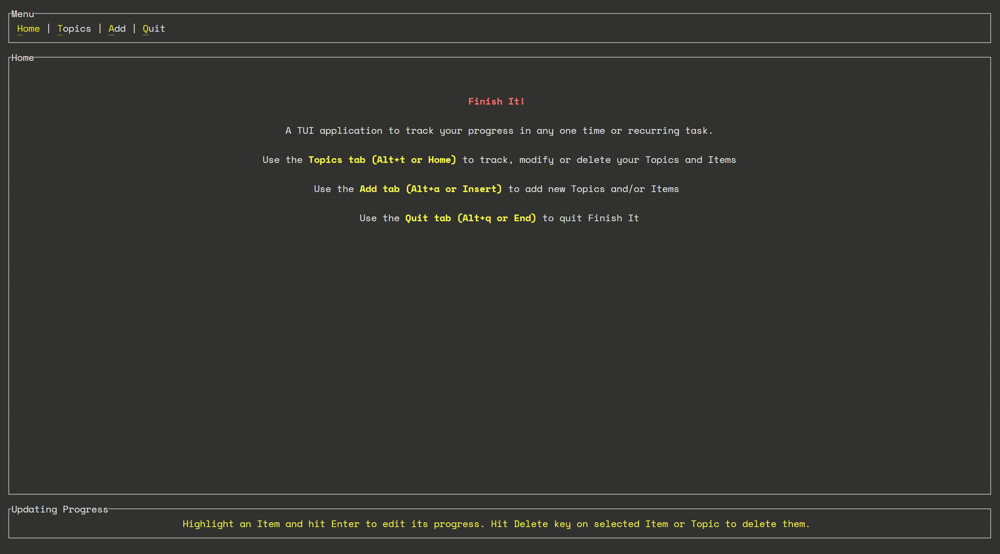
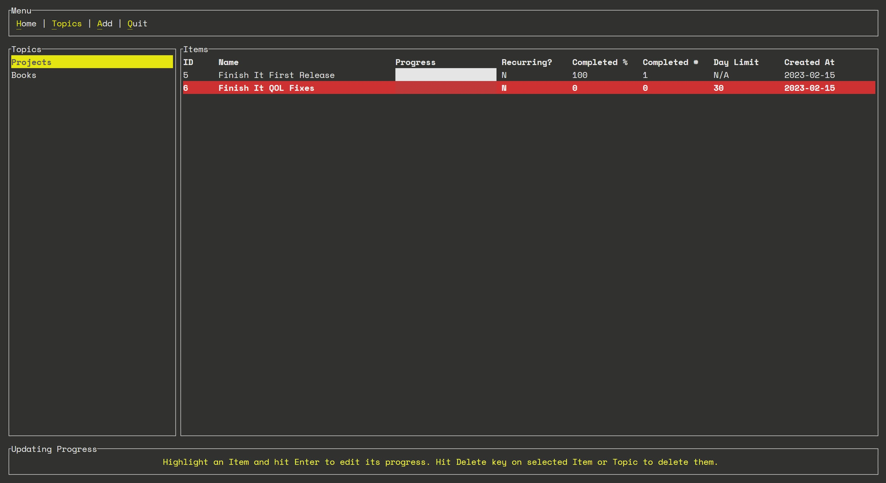
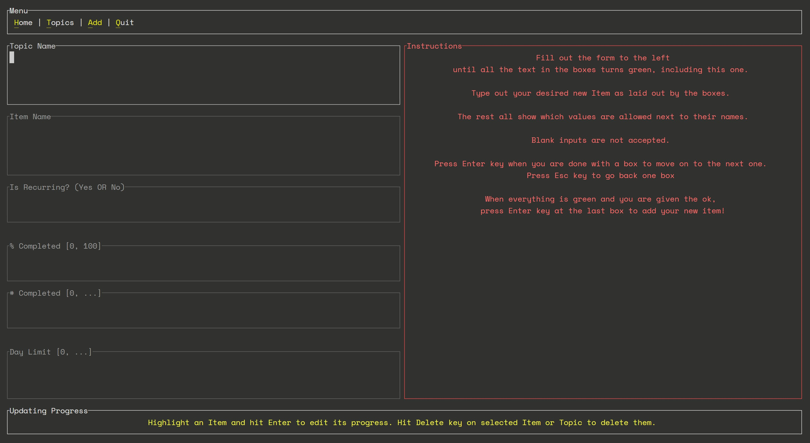
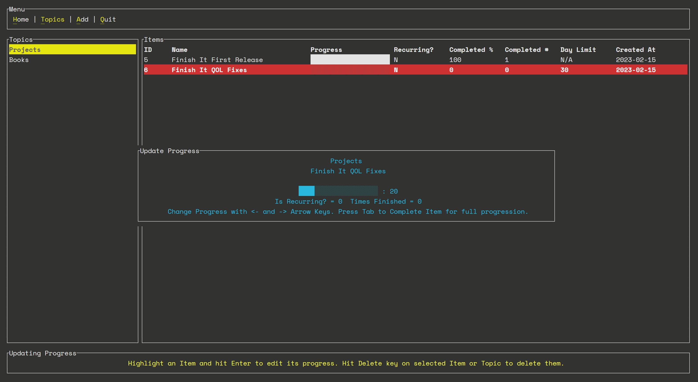
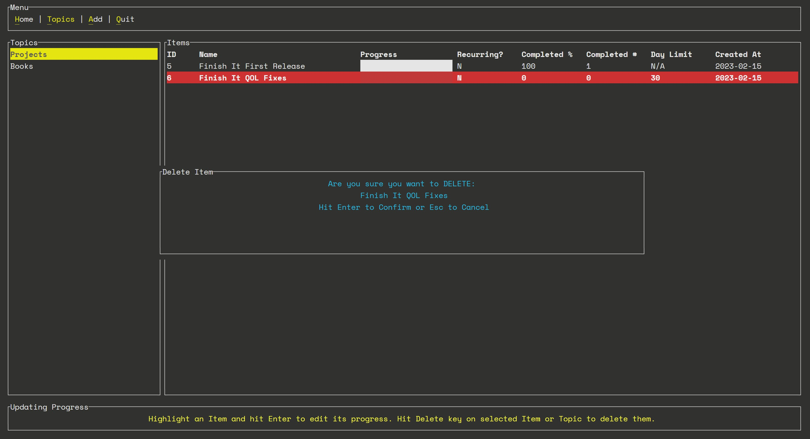
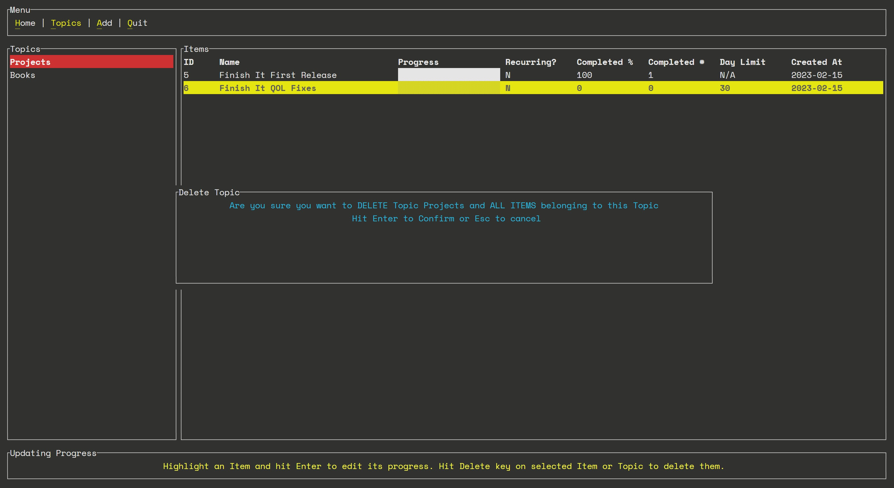

# Finish-it

[](https://github.com/nullscry/finish-it/actions/workflows/ci.yml)
[](https://github.com/nullscry/finish-it/releases)
[](https://crates.io/crates/finish-it)
[](https://docs.rs/crate/finish-it/)

A TUI application to track whatever is that you would actually like to finish after starting.
The project uses tui-rs and and sqlite database.

## Target Plaforms

- aarch64-linux
- x86_64-linux
- x86_64-macos
- x86_64-windows

## Installation

- Using cargo

  - ```sh
    cargo install finish-it
    ```

    will report where the binary is installed. The default location in Linux:

    ```sh
    Installing /home/<youruser>/.cargo/bin/finish-it
    ```

  - Then invoke the binary with

    ```sh
    /home/<youruser>/.cargo/bin/finish-it
    ```

    OR if `/home/<youruser>/.cargo/bin/` is in your PATH

    ```sh
    finish-it
    ```

- Using precompiled binaries

  - Download and install latest version for your architecture from [releases](https://github.com/nullscry/finish-it/releases)
  - Unzip, untar and directly use the binary like:
    ```sh
    finish-it
    ```
  - You might need to give executable permissions to the binary like:
    ```sh
    chmod +x finish-it
    ```

## Usage

Simply

```sh
finish-it
```

## Home Tab



## Topics Tab



## Add Tab



## Updating Progress



## Deleting

### Deleting Item



### Deleting Topic


